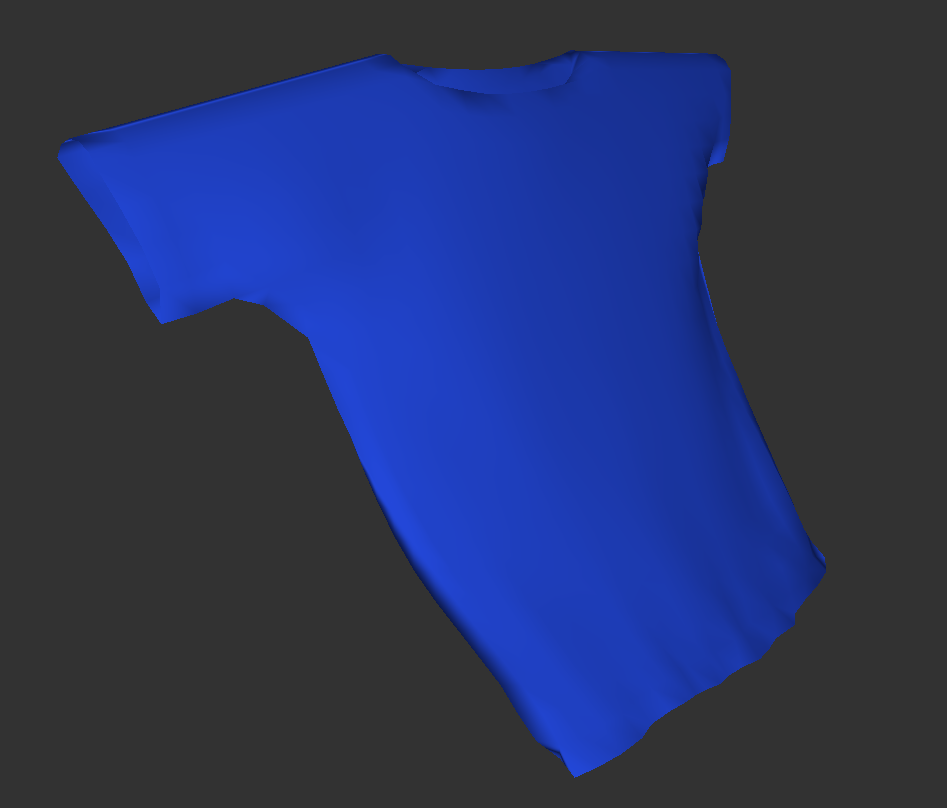
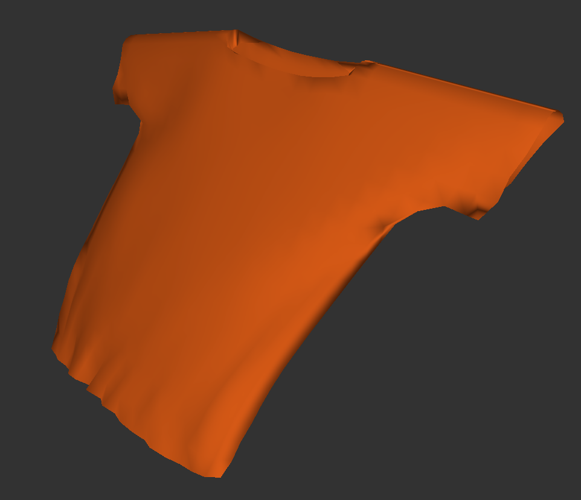

# Курсовая работа по компьютерной графике

https://user-images.githubusercontent.com/61819948/191996441-1401b508-0245-40a7-a36b-b7cee1eb076d.mp4

**Тема:** реалистичная визуализация плечевой одежды на примере футболки

**Студент:** Маслова Марина Дмитриевна

**Научный руководитель:** Оленев Антон Александрович

**Расчетно-пояснительная записка:** [РПЗ](./docs/pdf/MaslovaCG.pdf)

**Презентация:** [Презентация](./docs/pdf/presentation.pdf)

## Запуск

0. Установить пакеты `python3`, `python-pip3`, `make`, `git`

1. Склонировать репозиторий:

```bash
git clone https://github.com/MyMiDiII/bmstu-clothes.git
```

3. Перейти в директорию с исходным кодом

```bash
cd ./bmstu-clothes/src
```

4. Установить зависимости

```bash
pip install -r requirements.txt
```

5. Запустить

```bash
make
```

## Примеры работы программы

### Визуализация футболки




### Визуализация ткани


```
Курсовая работа по курсу "Компьютерная графика"
МГТУ им. Баумана
MyMiDiII
2021 г.
```
